# CLAW アーキテクチャドキュメント

> 本ドキュメントは claw-code リポジトリの全体構成・各コンポーネントの役割・エージェント設計を解説するものです。

---

## 目次

1. [プロジェクト概要](#1-プロジェクト概要)
2. [リポジトリ構成](#2-リポジトリ構成)
3. [高レベルアーキテクチャ](#3-高レベルアーキテクチャ)
4. [Python 層（ポートハーネス）](#4-python-層ポートハーネス)
5. [Rust 層（実行ランタイム）](#5-rust-層実行ランタイム)
6. [1 ターンのデータフロー](#6-1-ターンのデータフロー)
7. [エージェント構成](#7-エージェント構成)
8. [ツール分類](#8-ツール分類)
9. [パーミッションシステム](#9-パーミッションシステム)
10. [セッション・コンテキスト管理](#10-セッションコンテキスト管理)
11. [クロール可能性（Clawable）システム](#11-クロール可能性clawableシステム)
12. [実装状況サマリー](#12-実装状況サマリー)
13. [CLAW 機能とCopilotエージェントテンプレートの対応表](#13-claw-機能とcopilotエージェントテンプレートの対応表)

---

## 1. プロジェクト概要

**CLAW**（Claw Code）は、AI エージェントを用いたソフトウェアエンジニアリング支援システムです。  
本リポジトリは **Python ポートハーネス** と **Rust 実行ランタイム** の 2 層構造を持つ、公開オープン実装です。コードベース自体が clawhip を活用した自律的なコーディングエージェントループによって構築・拡張されています。

| レイヤー | 言語 | 役割 |
|---------|------|------|
| Python (`src/`) | Python 3.11+ | 構造ミラーリング・検査ハーネス・CLIルーティングスタブ |
| Rust (`rust/crates/`) | Rust 2021 edition | 実際の会話ループ・API クライアント・ツール実行・セッション管理 |

主な機能：
- **マルチエージェント編成**（6 種のビルトインエージェント）
- **動的ツール実行**（パーミッションゲート付き）
- **セッション管理**（メッセージコンパクション・トランスクリプト永続化）
- **MCP（Model Context Protocol）統合**（ハードニングされたライフサイクル管理含む）
- **フック機構**（PreToolUse / PostToolUse）
- **ワーカーブートステートマシン**（信頼ゲート・プロンプト誤配送の検出と自動リカバリ）
- **レーンイベントシステム**（機械可読な lane 状態と CI 統合）
- **GreenContract / 品質ゲート**（テスト完了度の形式的評価）
- **モックパリティハーネス**（スクリプト化されたシナリオによる動作検証）

---

## 2. リポジトリ構成

```
claw-code/
├── src/                     Python ポートハーネス（多数のサブモジュール）
│   ├── main.py              CLI エントリポイント
│   ├── runtime.py           PortRuntime: ルーティング・セッション起動
│   ├── query_engine.py      QueryEnginePort: ターン管理・コンパクション
│   ├── command_graph.py     CommandGraph: コマンド分類ツリー
│   ├── execution_registry.py ExecutionRegistry: コマンド/ツール委譲
│   ├── permissions.py       ToolPermissionContext: 許可ゲート
│   ├── session_store.py     StoredSession: JSON 永続化
│   ├── transcript.py        TranscriptStore: 会話ログ
│   ├── bootstrap_graph.py   BootstrapGraph: 起動フローグラフ
│   ├── parity_audit.py      パリティ監査ユーティリティ
│   ├── port_manifest.py     PortManifest: ワークスペース構造サマリー
│   ├── models.py            共通データクラス
│   ├── tool_pool.py         ToolPool: 実行時ツールプール構築
│   ├── hooks/               フックハンドラ群
│   ├── plugins/             プラグイン管理
│   ├── remote/              リモート接続ヘルパー
│   ├── skills/              スキルメタデータ
│   ├── schemas/             JSON スキーマ
│   ├── reference_data/      スナップショット（JSON）
│   │   ├── tools_snapshot.json
│   │   └── commands_snapshot.json
│   └── ...                  その他多数のサブモジュール
├── rust/
│   └── crates/
│       ├── api/             Anthropic API クライアント（SSE ストリーミング）
│       ├── runtime/         会話ループ・プロンプトビルダー・セッション・MCP・フック等
│       ├── tools/           ツールレジストリ・実装群
│       ├── commands/        スラッシュコマンド
│       ├── compat-harness/  互換メタデータ抽出
│       ├── rusty-claude-cli/ CLI エントリポイント（main.rs）
│       ├── plugins/         プラグイン管理・フック集約
│       ├── mock-anthropic-service/ 決定論的モック API サーバー
│       └── telemetry/       セッショントレーシング
├── CLAW.md                  プロジェクト指示ファイル（システムプロンプト探索対象）
├── PARITY.md                実装パリティ分析
├── ROADMAP.md               Clawable ハーネス開発ロードマップ
├── PHILOSOPHY.md            設計哲学
├── USAGE.md                 ビルド・認証・CLI ワークフロー
└── tests/                   テストスイート
```

---

## 3. 高レベルアーキテクチャ

```mermaid
graph TD
    User["👤 ユーザー\n(CLI / TUI / Discord)"]

    subgraph Python["Python ポートハーネス (src/)"]
        Main["main.py\nCLI エントリポイント"]
        Runtime["PortRuntime\nルーティング・セッション起動"]
        QueryEngine["QueryEnginePort\nターン管理・状態追跡"]
        Registry["ExecutionRegistry\nコマンド/ツール委譲"]
        CommandGraph["CommandGraph\nコマンド分類ツリー"]
        Permissions["ToolPermissionContext\nパーミッションゲート"]
        SessionStore["StoredSession\nJSON 永続化"]
        Transcript["TranscriptStore\n会話ログ"]
    end

    subgraph Rust["Rust 実行ランタイム (rust/crates/)"]
        CLI["rusty-claude-cli/main.rs\nRust CLI エントリポイント"]
        ConvLoop["ConversationRuntime\n会話ループ（ターン処理）"]
        PromptBuilder["SystemPromptBuilder\nシステムプロンプト構築"]
        ApiClient["ApiClient\nAnthropic API (SSE)"]
        ToolExec["ToolExecutor\nツール実行エンジン"]
        HookRunner["HookRunner\nPreToolUse / PostToolUse"]
        Session["Session\n会話状態・メッセージ履歴"]
        WorkerBoot["WorkerBootRegistry\nワーカー起動ステートマシン"]
        LaneEvents["LaneEventBus\nレーンイベント"]
        TaskRegistry["TaskRegistry\nタスクライフサイクル"]
        TeamRegistry["TeamRegistry\nチーム管理"]
        McpLifecycle["McpLifecycleValidator\nMCP ライフサイクル"]
        TrustResolver["TrustResolver\n信頼ゲート"]
        GreenContract["GreenContract\n品質ゲート"]
        RecoveryRecipes["RecoveryEngine\n自動リカバリ"]
        Telemetry["SessionTracer\nテレメトリ"]
    end

    subgraph External["外部サービス"]
        Anthropic["☁️ Anthropic API\n(Claude モデル)"]
        MCP["MCP サーバー\n(外部ツール/リソース)"]
        FS["🗂️ ファイルシステム\nCLAW.md / Git情報 / .claw/"]
        MockService["mock-anthropic-service\n決定論的テスト用"]
    end

    User --> Main
    User --> CLI

    Main --> Runtime
    Runtime --> QueryEngine
    Runtime --> Registry
    QueryEngine --> SessionStore
    QueryEngine --> Transcript
    Registry --> CommandGraph
    Registry --> Permissions

    CLI --> ConvLoop
    CLI --> WorkerBoot
    ConvLoop --> PromptBuilder
    ConvLoop --> ApiClient
    ConvLoop --> ToolExec
    ConvLoop --> HookRunner
    ConvLoop --> Session
    ConvLoop --> Telemetry
    WorkerBoot --> LaneEvents
    WorkerBoot --> TrustResolver
    WorkerBoot --> RecoveryRecipes
    TaskRegistry --> LaneEvents
    TeamRegistry --> TaskRegistry
    ConvLoop --> McpLifecycle
    ToolExec --> TaskRegistry
    GreenContract --> LaneEvents
    PromptBuilder --> FS

    ApiClient --> Anthropic
    ApiClient --> MockService
    McpLifecycle --> MCP

    style Python fill:#dbeafe,stroke:#3b82f6
    style Rust fill:#dcfce7,stroke:#16a34a
    style External fill:#fef9c3,stroke:#ca8a04
```

---

## 4. Python 層（ポートハーネス）

Python 層は構造ミラーリング・検査・ルーティング・セッション管理のスタブを提供します。実際の LLM 呼び出しは行わず、Rust 層の動作シミュレーションと構造理解のための足場として機能します。`src/` ディレクトリは大幅に拡張されており、現在 50 以上のサブモジュールを含みます。

### 4.1 CLI エントリポイント（`src/main.py`）

`argparse` ベースの CLI。主なサブコマンドは以下：

| サブコマンド | 機能 |
|-------------|------|
| `summary` | Python ポートサマリーを Markdown で出力 |
| `manifest` | 現在の Python ワークスペースマニフェストを出力 |
| `turn-loop` | ステートフルなターンループ実行 |
| `bootstrap` | セッション初期化・ルーティングレポート生成 |
| `route` | プロンプト→コマンド/ツールのマッチング |
| `commands` | ミラーされたコマンド一覧 |
| `tools` | ミラーされたツール一覧 |
| `exec-command` | コマンドシムの実行 |
| `exec-tool` | ツールシムの実行 |
| `load-session` | 保存済みセッションの読み込み |
| `flush-transcript` | トランスクリプトの永続化 |
| `parity-audit` | パリティ比較 |
| `command-graph` | コマンドグラフのセグメンテーション表示 |
| `tool-pool` | デフォルト設定でのアセンブルされたツールプール表示 |
| `bootstrap-graph` | ミラーされた Bootstrap グラフステージ表示 |
| `remote-mode / ssh-mode / teleport-mode / direct-connect-mode / deep-link-mode` | リモート接続モードのシミュレーション |

### 4.2 PortRuntime（`src/runtime.py`）

プロンプトルーティングとセッション起動を担当：

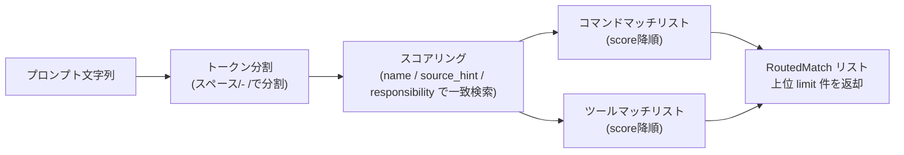

### 4.3 QueryEnginePort（`src/query_engine.py`）

セッションのターン管理・状態追跡を担当：

```python
QueryEngineConfig:
  max_turns: int = 8              # ターン上限
  max_budget_tokens: int = 2000   # トークン予算上限
  compact_after_turns: int = 12   # コンパクション閾値
  structured_output: bool = False # 構造化出力モード
  structured_retry_limit: int = 2 # 構造化出力の再試行回数
```

`submit_message()` の返却値 `TurnResult` には以下が含まれる：
- `matched_commands` / `matched_tools`：マッチしたコマンド/ツール名
- `permission_denials`：ブロックされたツール一覧
- `usage`：トークン使用量
- `stop_reason`：`completed` / `max_turns_reached` / `max_budget_reached`

### 4.4 CommandGraph（`src/command_graph.py`）

コマンドスナップショットから読み込んだコマンドを 3 分類する：

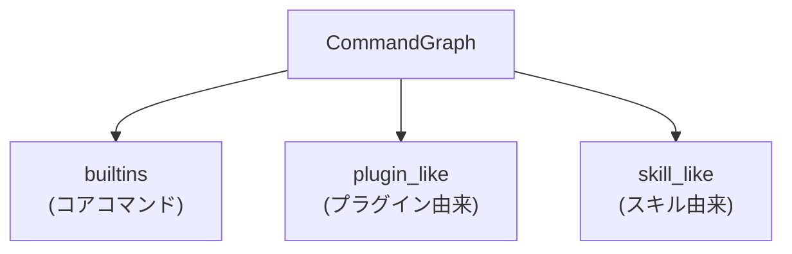

### 4.5 主要 Python サブモジュール（抜粋）

| モジュール | 役割 |
|-----------|------|
| `hooks/` | PreToolUse / PostToolUse フック群 |
| `plugins/` | プラグインライフサイクル管理 |
| `skills/` | スキルメタデータ |
| `remote/` | リモート接続ヘルパー |
| `tool_pool.py` | 実行時ツールプール構築 |
| `port_manifest.py` | ワークスペース構造サマリー生成 |
| `parity_audit.py` | パリティ監査ユーティリティ |
| `bootstrap_graph.py` | 起動フローグラフ（7 ステージ） |
| `schemas/` | JSON スキーマ定義 |
| `migrations/` | セッションデータ移行スクリプト |
| `state/` | ステートマシン補助 |

---

## 5. Rust 層（実行ランタイム）

Rust 層が実際のエージェント実行を担当し、Anthropic API との通信・ツール実行・セッション永続化を行います。2026-04-03 時点で **9 クレート**・**48,599 Rust LOC**・**292 コミット**の実装規模です。

### 5.1 クレート一覧

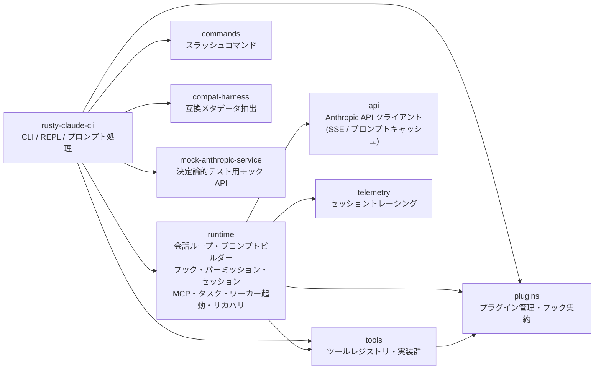

### 5.2 runtime クレートのモジュール構成

`rust/crates/runtime/src/` 以下の主要モジュール：

| モジュール | 役割 |
|-----------|------|
| `conversation.rs` | 会話ループのコア（`ConversationRuntime` / `ApiClient` / `ToolExecutor` trait） |
| `prompt.rs` | `SystemPromptBuilder` — プロンプト動的構築 |
| `session.rs` | セッション永続化 |
| `session_control.rs` | セッションハンドル・JSONL 形式ロード・フォーク |
| `permissions.rs` | `PermissionPolicy` / `PermissionMode` |
| `permission_enforcer.rs` | `PermissionEnforcer` — ツール実行ゲート |
| `hooks.rs` | `HookRunner` — PreToolUse / PostToolUse |
| `bash.rs` | `execute_bash` — タイムアウト・バックグラウンド・サンドボックス実行 |
| `bash_validation.rs` | Bash 検証サブモジュール群（6種の検証） |
| `file_ops.rs` | `read_file` / `write_file` / `edit_file` / `glob_search` / `grep_search` |
| `mcp.rs` + `mcp_client.rs` + `mcp_stdio.rs` | MCP クライアント・stdio プロセス管理 |
| `mcp_lifecycle_hardened.rs` | `McpLifecycleValidator` — 11 フェーズのライフサイクル検証 |
| `mcp_tool_bridge.rs` | MCP ツールブリッジ |
| `task_packet.rs` | `TaskPacket` — タスク仕様の構造化フォーマット |
| `task_registry.rs` | `TaskRegistry` — サブエージェントタスクライフサイクル |
| `team_cron_registry.rs` | `TeamRegistry` / `CronRegistry` — チームとスケジュールタスク管理 |
| `worker_boot.rs` | `WorkerBootRegistry` — ワーカー起動ステートマシン |
| `trust_resolver.rs` | `TrustResolver` — 信頼ゲート自動解決 |
| `lane_events.rs` | `LaneEvent` — 機械可読なレーン状態イベント |
| `green_contract.rs` | `GreenContract` — テスト完了度の形式的評価 |
| `stale_branch.rs` | `StaleBranchChecker` — ブランチ鮮度検査 |
| `recovery_recipes.rs` | `RecoveryEngine` — 7 種の既知障害シナリオへの自動リカバリ |
| `summary_compression.rs` | `compress_summary` — ツール出力圧縮 |
| `compact.rs` | セッションのメッセージコンパクション |
| `config.rs` | `ConfigLoader` — `.claw.json` / `settings.json` の探索とマージ |
| `oauth.rs` | OAuth PKCE フロー・認証情報の保存/読み込み |
| `sandbox.rs` | サンドボックス実行制限 |
| `remote.rs` | リモートヘルパー |
| `bootstrap.rs` | 起動フェーズ定義 |
| `policy_engine.rs` | ポリシーエンジン |
| `usage.rs` | `UsageTracker` — トークン使用量追跡 |

### 5.3 ConversationRuntime（`rust/crates/runtime/src/conversation.rs`）

ターンベースの会話ループを実装するコアコンポーネント：

```rust
ConversationRuntime<C: ApiClient, T: ToolExecutor>:
  session: Session                  // メッセージ履歴
  api_client: C                     // Anthropic API
  tool_executor: T                  // ツール実行エンジン
  permission_policy: PermissionPolicy
  system_prompt: Vec<String>
  max_iterations: usize             // デフォルト: usize::MAX（無制限）
  usage_tracker: UsageTracker
  hook_runner: HookRunner           // PreToolUse / PostToolUse
  session_tracer: SessionTracer     // テレメトリ
```

`run_turn()` の処理フロー：
1. ユーザーメッセージをセッションに追加
2. `api_client.stream(ApiRequest)` でイベントをストリーミング取得
3. `ToolUse` イベントを抽出
4. パーミッションチェック（`PermissionPolicy.authorize()`）
5. PreToolUse フック実行
6. ツール実行（`tool_executor.execute()`）
7. PostToolUse フック実行
8. ツール結果をセッションに追加し、ループを繰り返す
9. ツール使用なしなら終了。`TurnSummary` を返却

自動コンパクション閾値は環境変数 `CLAUDE_CODE_AUTO_COMPACT_INPUT_TOKENS`（デフォルト: 100,000 トークン）で制御される。

### 5.4 SystemPromptBuilder（`rust/crates/runtime/src/prompt.rs`）

複数のセクションを組み合わせてシステムプロンプトを動的構築する：

- イントロ・URLガード
- Output Style（任意）
- System / Doing Tasks / Executing Actions の静的セクション
- `__SYSTEM_PROMPT_DYNAMIC_BOUNDARY__` 区切り
- Environment Context（日時・CWD・プラットフォーム）
- Project Context（git status / git diff）
- Claw Instructions（`CLAW.md` 等、祖先方向探索、最大 12,000 文字）
- Runtime Config（`.claw.json` 等のマージ設定）
- Append Sections（LSP コンテキスト等）

**CLAW.md 探索ロジック：** ワークスペース祖先をルート側から順に走査し、各ディレクトリで `CLAW.md` → `CLAW.local.md` → `.claw/CLAW.md` → `.claw/instructions.md` の優先順で探索する。

---

## 6. 1 ターンのデータフロー

Rust runtime での 1 ターン処理の全シーケンス：

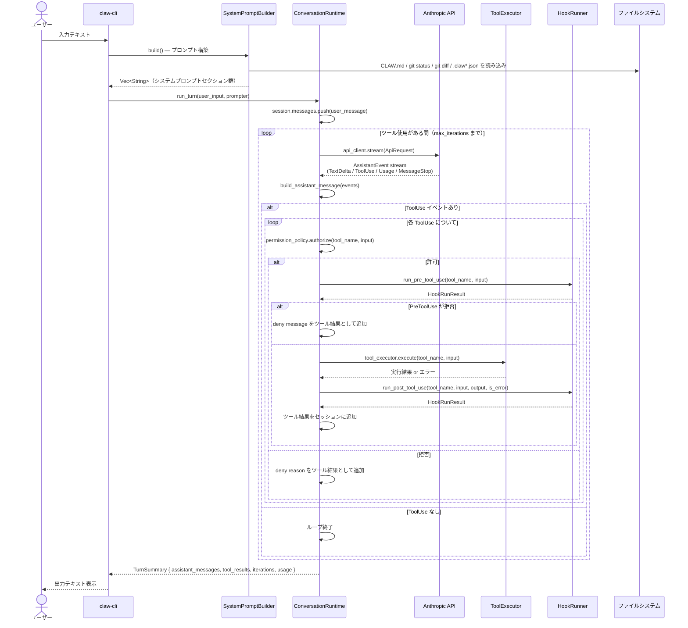

---

## 7. エージェント構成

### 7.1 エージェント一覧

Rust 側では `Agent` ツールが `subagent_type` を正規化し、共通ベース system prompt と許可ツール集合を与えてサブエージェントを起動します。

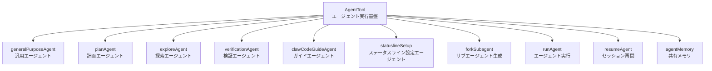

### 7.2 各エージェントの役割

| 名前 | Rust 正規化名 (`subagent_type`) | 役割 |
|------|----------------------------------|------|
| **generalPurposeAgent** | `general-purpose` | 一般的なコーディングタスク向けの既定エージェント。`subagent_type` 省略時もこの種別になる |
| **planAgent** | `Plan` | タスク分解・計画立案・ワークフロー編成に寄せたサブエージェント |
| **exploreAgent** | `Explore` | コードベース探索・ファイル発見・構造分析に寄せたサブエージェント（読み取り専用ツールのみ） |
| **verificationAgent** | `Verification` | テスト実行・実装検証・リグレッション確認に寄せたサブエージェント |
| **clawCodeGuideAgent** | `claw-guide` | CLAW の使い方や推奨ワークフロー案内向けのサブエージェント |
| **statuslineSetup** | `statusline-setup` | statusline 設定系。許可ツールは最小限の編集系に絞られる |

### 7.3 エージェント間通信

TaskRegistry / TeamRegistry が実装済みとなり、以下のタスク調整パターンが利用可能です。

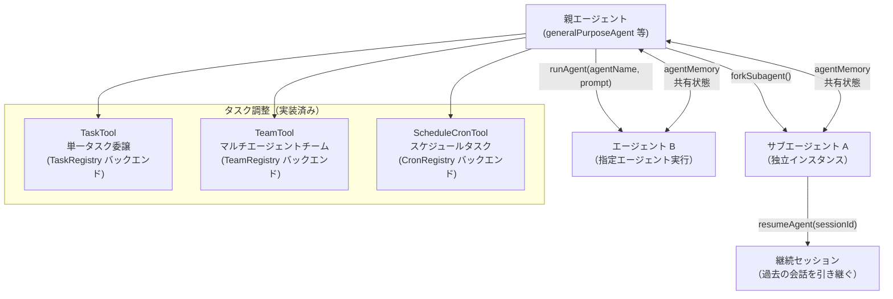

---

## 8. ツール分類

### 8.1 ツール全体マップ

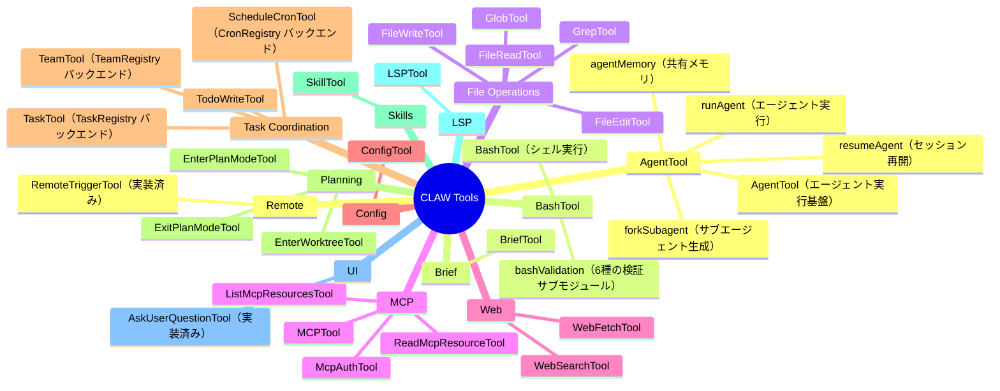

### 8.2 ツール実行パイプライン（Rust）

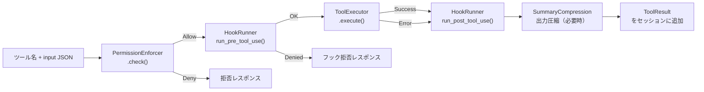

---

## 9. パーミッションシステム

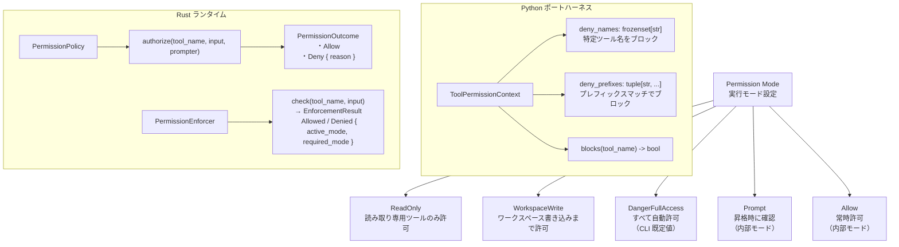

CLI の `--permission-mode` で選べるのは `read-only` / `workspace-write` / `danger-full-access` の 3 つで、`Prompt` / `Allow` はランタイム内部で扱われるモードです。

---

## 10. セッション・コンテキスト管理

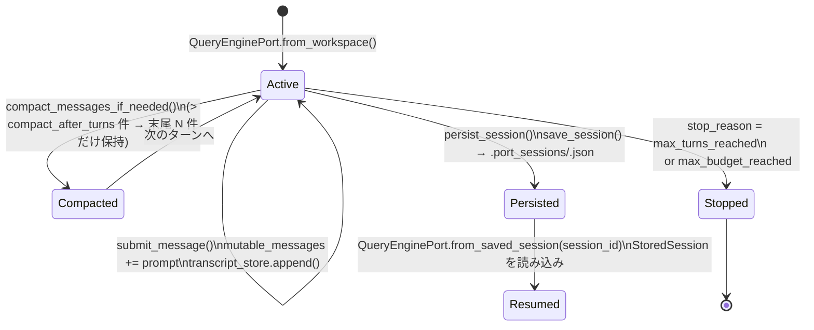

### コンパクション閾値一覧

| パラメータ | デフォルト値 | 説明 |
|-----------|------------|------|
| `max_turns` | 8 | これ以上のターンは受け付けない |
| `max_budget_tokens` | 2,000 | トークン予算上限 |
| `compact_after_turns` | 12 | これを超えたらメッセージを末尾から切り詰める |
| 自動コンパクション（Rust） | 100,000 トークン | 入力トークン超過時に自動コンパクション |

### Rust 側のセッション構造

```rust
Session {
    messages: Vec<ConversationMessage>
}

ConversationMessage {
    role: Role,                // user | assistant
    blocks: Vec<ContentBlock>
}

ContentBlock {
    Text(String),
    ToolUse { id, name, input },
    ToolResult { tool_use_id, content, is_error }
}
```

セッションファイルは `.jsonl` 形式（プライマリ）と `.json` 形式（レガシー）をサポート。`session_control.rs` が `latest` / `last` / `recent` などのエイリアスでの参照、セッションのフォーク（親セッション ID とブランチ名を保持）を提供します。

---

## 11. クロール可能性（Clawable）システム

このシステムには、自律的なエージェントワークフローを支えるためのインフラストラクチャが複数組み込まれています。

### 11.1 ワーカーブートステートマシン（`worker_boot.rs`）

コーディングワーカーの起動を、端末の生テキストではなく明示的な状態遷移として管理します。

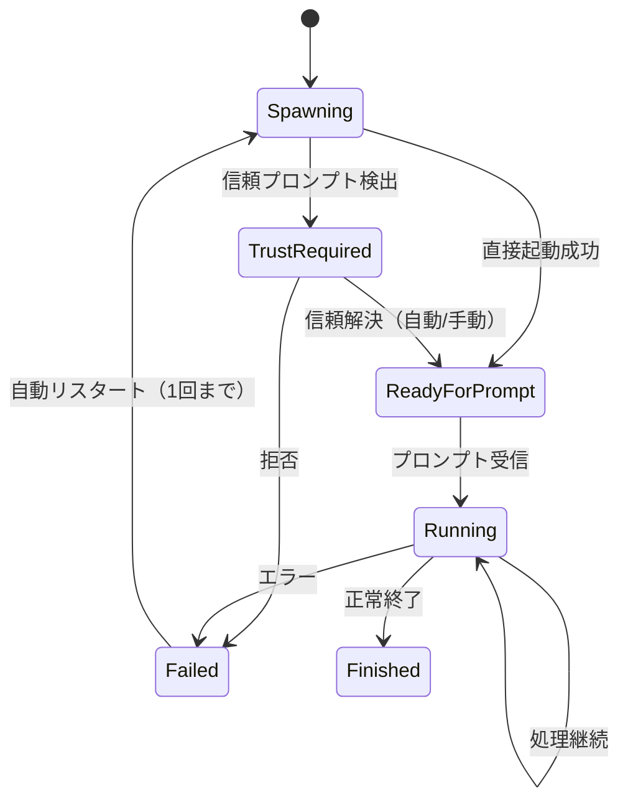

`WorkerEventKind` により `spawning` / `trust_required` / `trust_resolved` / `ready_for_prompt` / `prompt_misdelivery` / `prompt_replay_armed` / `running` / `restarted` / `finished` / `failed` の各イベントが発行されます。

### 11.2 レーンイベントシステム（`lane_events.rs`）

CI・並列作業・エージェント間調整に対応する機械可読なイベントバス：

| イベント名 | 説明 |
|-----------|------|
| `lane.started` | レーン開始 |
| `lane.ready` | 作業受け入れ準備完了 |
| `lane.blocked` | ブロッキング障害 |
| `lane.red` | テスト失敗 |
| `lane.green` | テスト通過 |
| `lane.commit.created` | コミット作成 |
| `lane.pr.opened` | PR オープン |
| `lane.merge.ready` | マージ準備完了 |
| `lane.finished` | 正常完了 |
| `lane.failed` | 失敗 |
| `branch.stale_against_main` | main に対してブランチが古い |

### 11.3 GreenContract / 品質ゲート（`green_contract.rs`）

テスト完了度を形式的に評価するコントラクト：

```rust
GreenLevel:
  TargetedTests  // 対象テストのみ通過
  Package        // パッケージ全体通過
  Workspace      // ワークスペース全体通過
  MergeReady     // マージ可能レベル
```

### 11.4 自動リカバリ（`recovery_recipes.rs`）

7 種の障害シナリオに対して既知のリカバリレシピを提供し、エスカレーション前に 1 回自動リカバリを試みます：

| シナリオ | トリガー |
|---------|---------|
| `TrustPromptUnresolved` | 信頼プロンプト未解決 |
| `PromptMisdelivery` | プロンプト誤配送 |
| `StaleBranch` | ブランチが陳腐化 |
| `CompileRedCrossCrate` | クレートコンパイル失敗 |
| `McpHandshakeFailure` | MCP ハンドシェイク失敗 |
| `PartialPluginStartup` | プラグイン部分起動 |
| `ProviderFailure` | API プロバイダー障害 |

### 11.5 StaleBranchChecker（`stale_branch.rs`）

main に対するブランチ鮮度を `Fresh` / `Stale { commits_behind }` / `Diverged { ahead, behind }` の 3 状態で評価。`StaleBranchPolicy` として `AutoRebase` / `AutoMergeForward` / `WarnOnly` / `Block` を適用できます。

### 11.6 MCP ライフサイクル管理（`mcp_lifecycle_hardened.rs`）

11 フェーズのライフサイクル検証：`ConfigLoad` → `ServerRegistration` → `SpawnConnect` → `InitializeHandshake` → `ToolDiscovery` → `ResourceDiscovery` → `Ready` → `Invocation` → `ErrorSurfacing` → `Shutdown` → `Cleanup`

部分起動（あるサーバーは成功、他は失敗）を first-class な状態として `McpDegradedReport` で表現します。

### 11.7 モックパリティハーネス

`rust/crates/mock-anthropic-service` に決定論的なモック API サーバーを用意。`rusty-claude-cli/tests/mock_parity_harness.rs` で 10 のスクリプト済みシナリオ・19 の `/v1/messages` リクエストをカバーします：

| シナリオ | 内容 |
|---------|------|
| `streaming_text` | テキストストリーミング |
| `read_file_roundtrip` | ファイル読み込みラウンドトリップ |
| `grep_chunk_assembly` | grep 結果アセンブリ |
| `write_file_allowed` | 書き込み許可フロー |
| `write_file_denied` | 書き込み拒否フロー |
| `multi_tool_turn_roundtrip` | マルチツールターン |
| `bash_stdout_roundtrip` | Bash 標準出力 |
| `bash_permission_prompt_approved` | Bash パーミッションプロンプト（承認） |
| `bash_permission_prompt_denied` | Bash パーミッションプロンプト（拒否） |
| `plugin_tool_roundtrip` | プラグインツール実行 |

### 11.8 起動フロー（Bootstrap Graph）

`src/bootstrap_graph.py` が定義するシステム起動の 7 段階：

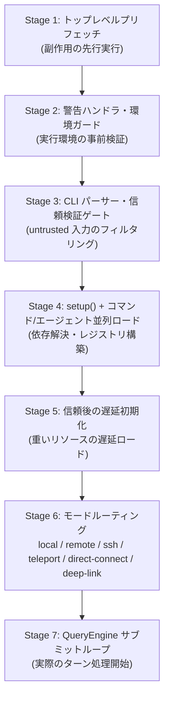

---

## 12. 実装状況サマリー

2026-04-03 時点の状況（`PARITY.md` より）：**9 クレート**・**48,599 Rust LOC**・**292 コミット**・**9-lane チェックポイント完了**

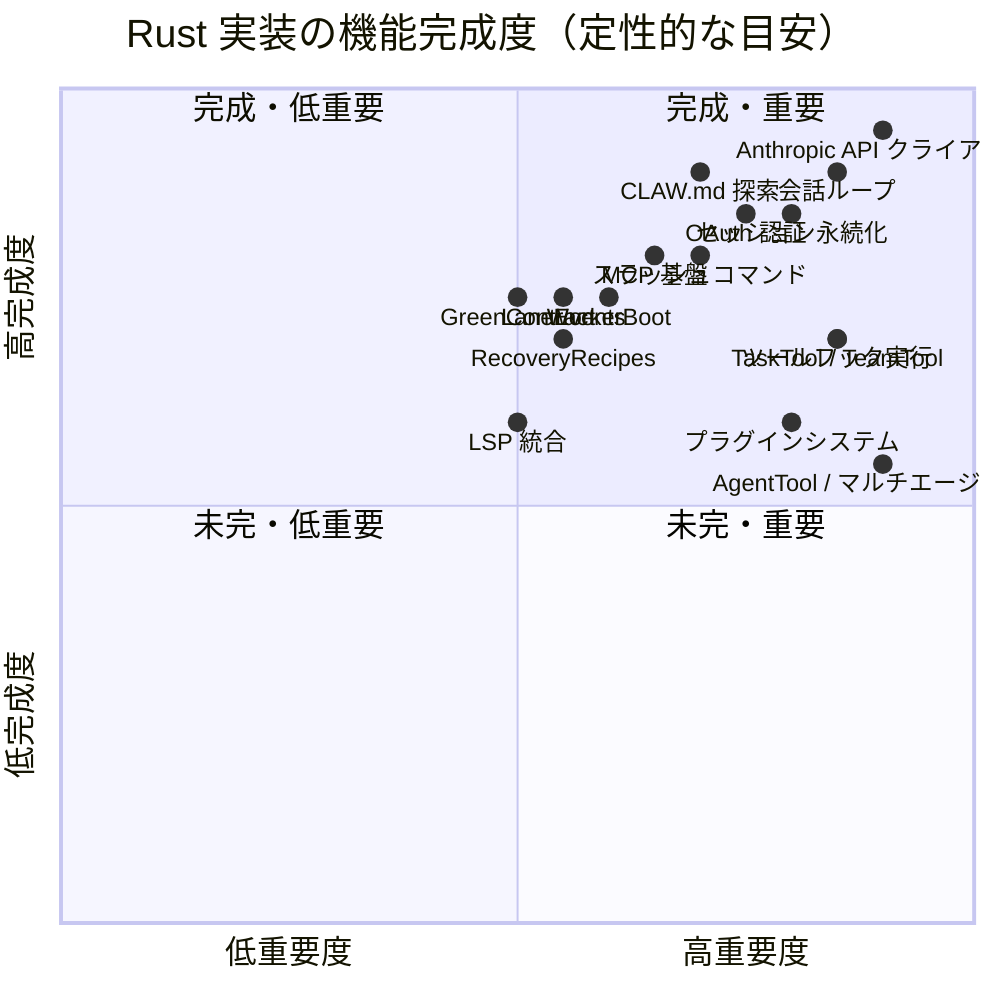

### 詳細ステータス

| 機能領域 | ステータス | 備考 |
|---------|----------|------|
| 会話ループ・API ストリーミング | ✅ 完成 | コア実装 |
| OAuth / 認証 | ✅ 完成 | PKCE フロー含む |
| CLAW.md 探索・プロンプト注入 | ✅ 完成 | |
| MCP stdio / bootstrap | ✅ 完成 | ハードニングライフサイクル含む |
| セッション永続化 | ✅ 完成 | JSONL + JSON フォーマット |
| スラッシュコマンド | ✅ 部分実装 | `/plugin` `/agents` `/skills` 等含む 28+ コマンド |
| BashTool / FileReadTool 等 コアツール | ✅ 完成 | Bash 検証 6 サブモジュール |
| **TaskTool / TeamTool / CronTool** | ✅ 完成 | TaskRegistry / TeamRegistry / CronRegistry バックエンド |
| **AskUserQuestionTool** | ✅ 完成 | `ee31e00` で実装 |
| **RemoteTriggerTool** | ✅ 完成 | `ee31e00` で実装 |
| **WorkerBoot ステートマシン** | ✅ 完成 | 6 状態・10 イベント種別 |
| **LaneEvents** | ✅ 完成 | 17 イベント種別 |
| **GreenContract** | ✅ 完成 | 4 レベル |
| **RecoveryRecipes** | ✅ 完成 | 7 シナリオ |
| **StaleBranchChecker** | ✅ 完成 | 4 ポリシー |
| **モックパリティハーネス** | ✅ 完成 | 10 シナリオ・19 リクエスト |
| フック実行 (PreToolUse/PostToolUse) | ⚠️ 部分実装 | deny/warn 中心 |
| プラグインシステム | ⚠️ 部分実装 | install/enable/disable/update/uninstall と hook 集約あり |
| AgentTool / マルチエージェント | ⚠️ 部分実装 | `Agent` ツールによるサブエージェント起動あり |
| LSPTool | ⚠️ 部分実装 | 基本統合のみ |
| 構造化 IO / リモートトランスポート | ⚠️ 部分実装 | JSON 出力や remote helper あり |

---

## 13. CLAW 機能とCopilotエージェントテンプレートの対応表

> CLAW が Rust / Python で実装している各機能と、`copilot-agent-template` がそれをどのように再現しているかを対比します。  
> 「対応レベル」は **◎ 同等 / ○ 近似 / △ 部分的 / ✗ 未対応** で示します。

### 13.1 エージェント・サブエージェント

| CLAW 機能 | 実装場所 | Copilot テンプレート | テンプレートファイル | 対応レベル |
|-----------|----------|---------------------|---------------------|-----------|
| `exploreAgent`（読み取り専用探索） | `AgentTool` / `subagent_type=Explore` | `@Explore` agent | `explore.template.agent.md` | ◎ |
| `planAgent`（計画立案） | `AgentTool` / `subagent_type=Plan` | `@Plan` agent + handoff ボタン | `plan.template.agent.md` | ◎ |
| `generalPurposeAgent`（実装） | `AgentTool` / `subagent_type=general-purpose` | `@Implementer` agent | `implementer.template.agent.md` | ◎ |
| `verificationAgent`（検証） | `AgentTool` / `subagent_type=Verification` | `@Verification` agent | `verification.template.agent.md` | ◎ |
| `reviewerAgent`（レビュー） | `AgentTool` / `subagent_type=Review` | `@Reviewer` agent | `reviewer.template.agent.md` | ◎ |
| `autonomousPipeline`（5 レーン自律実行） | `AgentTool` オーケストレーター | `@{{AUTONOMOUS_AGENT_NAME}}` agent | `autonomous.template.agent.md` | ◎ |
| `TaskTool` / `TeamTool`（サブエージェント委譲） | `task_registry.rs` / `team_registry.rs` | agent tool + handoff ボタン / インライン委譲プロンプト | autonomous agent `agents:` リスト | ○ |
| `AskUserQuestionTool`（最小限の確認） | `tools/` | clarifying question（plan agent） | `plan.template.agent.md` | ○ |

### 13.2 レーンイベントとパイプライン状態

| CLAW 機能 | 実装場所 | Copilot テンプレート | テンプレートファイル | 対応レベル |
|-----------|----------|---------------------|---------------------|-----------|
| `LaneEvents`（17 イベント種別、機械可読） | `lane_events.rs` | `▶/✓/✗ [LANE:name]` インラインテキストプロトコル | all agent templates | ○ |
| `lane.started / lane.finished / lane.blocked` | `lane_events.rs` | `▶ [LANE:x]` / `✓ [LANE:x:complete]` / `✗ [LANE:x:blocked]` | autonomous / implementer / verification | ○ |
| Pipeline Summary ブロック（完了時出力） | `summary.rs` | `── Pipeline Summary ──` テキストブロック | `autonomous.template.agent.md` | ○ |
| `SessionTracer` / テレメトリ | `tracer.rs` | `post-tool-use.json` + `log-tool-use.sh`（ファイル追記） | `hooks/` + `scripts/` | △ |

### 13.3 フック機構

| CLAW 機能 | 実装場所 | Copilot テンプレート | テンプレートファイル | 対応レベル |
|-----------|----------|---------------------|---------------------|-----------|
| `PreToolUse` フック | `hooks.rs` / `HookRunner` | `pre-tool-use.json` → `guard-dangerous-command.sh` | `hooks/pre-tool-use.template.json` | ○ |
| `PostToolUse` フック | `hooks.rs` / `HookRunner` | `post-tool-use.json` → `log-tool-use.sh` | `hooks/post-tool-use.template.json` | ○ |
| `HookRunner`（deny / warn / approve） | `hook_runner.rs` | guard スクリプトが `exit 1` で拒否、`exit 0` で許可 | `guard-dangerous-command.template.sh` | △ |
| 危険コマンド検出（`rm -rf`、秘密情報漏洩等） | `permission_enforcer.rs` | 正規表現パターンマッチ（`eval`、`gh pr merge`、`printenv *KEY` 等） | `guard-dangerous-command.template.sh` | ○ |

### 13.4 パーミッション・ブラストラジアス制御

| CLAW 機能 | 実装場所 | Copilot テンプレート | テンプレートファイル | 対応レベル |
|-----------|----------|---------------------|---------------------|-----------|
| `PermissionEnforcer`（ブラストラジアスチェック） | `permission_enforcer.rs` | `{{FORBIDDEN_PATTERNS}}` ゲート（plan 承認前に必須チェック） | `autonomous.template.agent.md` | ○ |
| `StaleBranchChecker`（変更範囲超過検出） | `stale_branch.rs` | 変更ファイル数 > 10 でユーザー確認要求 | `autonomous.template.agent.md` | ○ |
| `OUTPUT_DIR` ガード（出力ディレクトリ書き込み禁止） | `permission_enforcer.rs` | `{{OUTPUT_DIR}}` への plan タッチ → abort | `autonomous.template.agent.md` | ◎ |

### 13.5 品質ゲートとリカバリ

| CLAW 機能 | 実装場所 | Copilot テンプレート | テンプレートファイル | 対応レベル |
|-----------|----------|---------------------|---------------------|-----------|
| `GreenContract`（品質ゲート、4 レベル） | `green_contract.rs` | `{{E2E_GATE_COMMAND}}` 必須実行 + lint / build / test コマンド | `verification.template.agent.md` | ○ |
| `RecoveryRecipes`（自動リカバリ、7 シナリオ） | `recovery_recipes.rs` | 自己修正ループ（最大 2 回） | `implementer.template.agent.md` | △ |
| `MockParityHarness`（スクリプト化シナリオ検証） | `mock-anthropic-service` | `{{E2E_GATE_COMMAND}}` で代替 | `verification.template.agent.md` | △ |

### 13.6 セッション・コンテキスト管理

| CLAW 機能 | 実装場所 | Copilot テンプレート | テンプレートファイル | 対応レベル |
|-----------|----------|---------------------|---------------------|-----------|
| `WorkerBootRegistry`（セッション再起動・状態マシン） | `worker_boot.rs` | `SESSION CHECKPOINT` ブロック（コンテキスト超過時に出力） | `autonomous.template.agent.md` | ○ |
| `SummaryCompression`（メッセージ圧縮） | `summary.rs` | Copilot が内部管理（エージェント非制御） | — | ✗ |
| セッション永続化（JSONL / JSON） | `session.rs` | `tool-use.log` 追記のみ | `log-tool-use.template.sh` | △ |

### 13.7 プロンプト・指示注入

| CLAW 機能 | 実装場所 | Copilot テンプレート | テンプレートファイル | 対応レベル |
|-----------|----------|---------------------|---------------------|-----------|
| `CLAW.md` 探索（祖先ディレクトリ方向） | `prompt.rs` `SystemPromptBuilder` | `copilot-instructions.md`（`applyTo: "**"` で全体適用） | `copilot-instructions.template.md` | ◎ |
| エージェント別プロンプト注入（`.agent.md`） | `task_registry.rs` | `.github/agents/*.agent.md` の `system:` フィールド | 各 `*.template.agent.md` | ◎ |
| スキルシステム（`/skills/` 探索・注入） | `command_graph.py` / `skills/` | `.github/skills/` + `chat.skillsLocations` | `skills/` templates + `vscode-settings.template.json` | ○ |
| コマンドグラフ（スラッシュコマンド） | `command_graph.py` | VS Code プロンプトピッカー（`prompts/*.prompt.md`） | `prompts/` templates | ○ |

### 13.8 環境サーフェス対応

| CLAW 機能 | 実装場所 | Copilot テンプレート | テンプレートファイル | 対応レベル |
|-----------|----------|---------------------|---------------------|-----------|
| `RemoteTriggerTool`（Issue / 外部イベント入力） | `tools/` | Issue アサインによるブラウザ起動（`copilot-instructions.md` の Issue セクション） | `copilot-instructions.template.md` | ○ |
| CLI ターミナル（`--print` / `--dangerously-skip-permissions`） | `main.rs` | VS Code Chat の terminal アクセス | VS Code 設定 | ○ |
| ブラウザ環境検出（ハンドオフボタンなし時） | — | 環境認識テーブル + インライン委譲プロンプト出力 | `autonomous.template.agent.md` | ○ |

### 13.9 未対応（Copilot テンプレートに相当なし）

| CLAW 機能 | 理由 |
|-----------|------|
| OAuth / `claw login`（PKCE フロー） | Copilot は認証不要（GitHub 認証に統合済み） |
| MCP ライフサイクル管理（stdio bootstrap / ハードニング） | Copilot で MCP サーバーのライフサイクルをエージェントが制御できない |
| `CronRegistry` / `ScheduleCronTool`（定期実行） | Copilot にスケジューラなし |
| `statuslineSetup` agent（TUI ステータスライン） | UI 統合なし |
| `SummaryCompression`（メッセージ圧縮API） | Copilot が内部で管理、エージェントから非露出 |
| `SessionTracer` / テレメトリ（構造化トレース） | Copilot に露出なし（`tool-use.log` で部分代替のみ） |
| `LSPTool`（Language Server Protocol 統合） | Copilot が独自 LSP 統合を持つが agent template 管轄外 |
| `PluginSystem`（install / enable / update） | Copilot 拡張は VS Code Marketplace 経由のみ |
